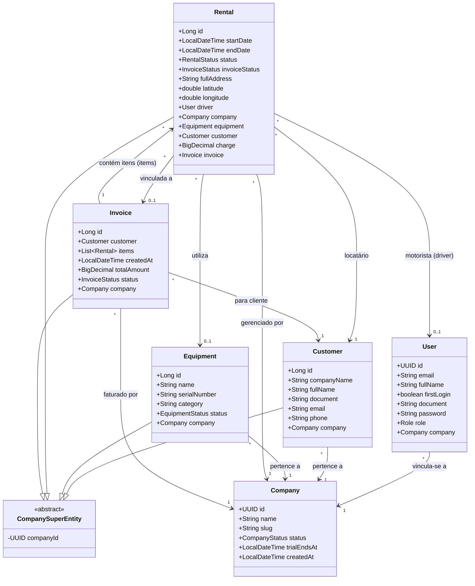

# Diagrama de Classes - Dumply

Este documento apresenta o diagrama de classes das principais entidades do projeto Dumply, detalhando seus atributos e relacionamentos.

## Descrição das Entidades

- **Company**: Representa o inquilino (tenant) do sistema.
- **User**: Usuários que acessam o sistema, podendo ser ADMIN, OWNER, MANAGER ou DRIVER.
- **Customer**: Clientes que realizam os aluguéis.
- **Equipment**: Equipamentos (caçambas/máquinas) disponíveis para aluguel.
- **Rental**: Representa a transação de aluguel entre a empresa e o cliente.
- **Invoice**: Agrupamento de aluguéis para faturamento ao cliente.
- **CompanySuperEntity**: Classe base que fornece a infraestrutura de multi-tenancy para as entidades que dependem de uma empresa.
